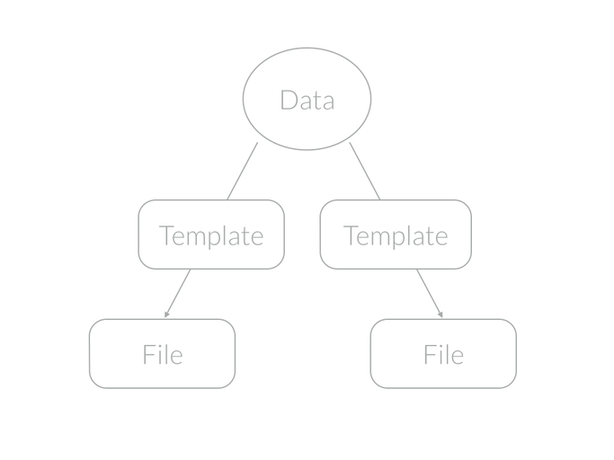

coz
==========

<!---
This file is generated by ape-tmpl. Do not update manually.
--->

<!-- Badge Start -->
<a name="badges"></a>

[![Build Status][bd_travis_shield_url]][bd_travis_url]
[![npm Version][bd_npm_shield_url]][bd_npm_url]
[![JS Standard][bd_standard_shield_url]][bd_standard_url]

[bd_repo_url]: https://github.com/coz-labo/coz
[bd_travis_url]: http://travis-ci.org/coz-labo/coz
[bd_travis_shield_url]: http://img.shields.io/travis/coz-labo/coz.svg?style=flat
[bd_travis_com_url]: http://travis-ci.com/coz-labo/coz
[bd_travis_com_shield_url]: https://api.travis-ci.com/coz-labo/coz.svg?token=
[bd_license_url]: https://github.com/coz-labo/coz/blob/master/LICENSE
[bd_codeclimate_url]: http://codeclimate.com/github/coz-labo/coz
[bd_codeclimate_shield_url]: http://img.shields.io/codeclimate/github/coz-labo/coz.svg?style=flat
[bd_codeclimate_coverage_shield_url]: http://img.shields.io/codeclimate/coverage/github/coz-labo/coz.svg?style=flat
[bd_gemnasium_url]: https://gemnasium.com/coz-labo/coz
[bd_gemnasium_shield_url]: https://gemnasium.com/coz-labo/coz.svg
[bd_npm_url]: http://www.npmjs.org/package/coz
[bd_npm_shield_url]: http://img.shields.io/npm/v/coz.svg?style=flat
[bd_standard_url]: http://standardjs.com/
[bd_standard_shield_url]: https://img.shields.io/badge/code%20style-standard-brightgreen.svg

<!-- Badge End -->


<!-- Description Start -->
<a name="description"></a>

Flexible generator, which makes your project clean and maintainable.

<!-- Description End -->


<!-- Overview Start -->
<a name="overview"></a>


<a href="https://github.com/coz-labo/coz"></a>


```javascript
// Define rendering rule.
module.exports = {
  path: 'have-a-nice-day.txt', // File path to write
  tmpl: '.have-a-nice-day.txt.hbs', // Template file
  force: true, // Overwrite each time
  mode: '444',  // As readyonly file
  data: require('./my-datasource.json') // Data to render
}
```

Save this as ***.my-first-bud.bud*** , then running 
 
```bash
$ coz render ".my-first-bud.bud"
```

will do the magic.


<!-- Overview End -->


<!-- Sections Start -->
<a name="sections"></a>

<!-- Section from "doc/guides/01-about.md.hbs" Start -->

<a name="section-doc-guides-01-about-md"></a>

About coz
------

### What's This?

The basic idea of coz is that creating files from files.

1. Writing a meta file called [.bud file](#spec-bud-spec).
2. Running `coz render` command.
3. Files will be generated!




### What For?

Automation. Generating files makes your project clean and maintainable.

You can define a single datasource and distribute it in various forms.

For example,

+ Generate Javascript and Python entity from database definition.
+ Generate Web API document and Swift client entity from json schema objects.
+ Generate skelton test case files from project files.


### Why This?

+ **Lightweight and fast**
  + coz does nothing bud file templating, it's very fast.
+ **Unopinionated and flexible**
+ coz could be used to any kind of strings files.
  + Bunch of options to manipulate files.
+ Could be used by CLI or programmatically.
  + **Simple and extensible**
+ coz provides ways to customize, like registering your own template engine.


<!-- Section from "doc/guides/01-about.md.hbs" End -->

<!-- Section from "doc/guides/02-howto.md.hbs" Start -->

<a name="section-doc-guides-02-howto-md"></a>

Getting started
------

### Requirements

+ [node.js][nodejs_url]


### Installation

coz is available as an [npm][npm_url] package.

```bash
# Install coz as a global module.
$ npm install coz -g
```

Or you can install it without `-g` option and use [Programmatic API](#programmatic-api).
For more details, see tutorial section "[01 - Installing coz][01_installing_coz_url]".


### Quickstart

**.who-likes-what.txt.bud** (bud file)
```javascript
/**
 * .who-likes-what.txt.bud
 * This is a bud file for "examples/01-minimum-demo"
 */

// Exports as a Node.js module.
module.exports = {

    // Template string. By default, parsed by Handlebars engine.
    tmpl: '{{#each members}}Hi, my name is {{@key}}. I like {{this}}.\n{{/each}}',

    // Overwrite when already existing.
    force: true,

    // File path to write out.
    path: 'who-likes-what.txt',

    // File permission.
    mode: '444',

    // Data to render.
    data: {
        members: {
            "Mai": "apple",
            "Tom": "Orange",
            "Rita": "Banana"
        }
    }
};

```

As you see, `.bud` file is actuary a JavaScript file and could be exported a Node.js module.

Save this file as `.who-likes-what.txt.bud` and then, run:

```bash
# Render the bud file
$ coz render ".who-likes-what.txt.bud"
```

This will generate a file named `who-likes-what.txt`.

For more details, see tutorial section "[02 - Rendering bud files][02_rendering_bud_files_url]".


<a name="programmatic-api" />
### Programmatic API

coz provides programmatic API which enables you to execute coz commands from Node.js program.

```javascript
#!/usr/bin/env node

/**
 * run_rendering.js
 * This is an executable file for "examples/04-from-programmatic-api/run_rendering.js"
 */

var coz = require('coz');

// Render .bud files.
coz.render([
    '**/.*.bud'
], function (err) {
    console.log(err ? err : 'Done!');
});
```

For more details, see tutorial section "[04 - Using programmatic API][04_using_programmatic_a_p_i_url]".


[nodejs_url]: https://nodejs.org/en/
[npm_url]: https://www.npmjs.com/


<!-- Section from "doc/guides/02-howto.md.hbs" End -->

<!-- Section from "doc/guides/03-spec.md.hbs" Start -->

<a name="section-doc-guides-03-spec-md"></a>

Specifications
---------

<a name="spec-bud-spec"></a>
### Bud File Specification

A bud contains file meta data like witch template to use, where to render it, what permission to give, and so on.

You can specify bud data by writing `.bud` file, which is actually a javascript file and could be written in Node.js format.

```javascript
module.exports = {
  path: 'my_file.txt',
  tmpl: '.my_file.txt.hbs',
  data: require('./.my_data')
}
```

And bud could be an array like:

```javascript
module.exports = [
  { path: 'my_file.txt', /* ... */ },
  { path: 'my_other_file.txt', /* ... */ },
]
```

Or an async function.

```javascript
module.exports = function(callback){
  myAsync((data) => {
   let error = null
   callback(err, data)
  })
}
```

For more details, see tutorial section "[03 - Mastering coz bud][03_mastering_coz_bud_url]".

##### Supported Properties

List of properties configurable in bud files.

| Name | Type | Default | Description |
| ----- | ----- | ----- | ----- |
| `engine` | string|object | &#x27;handlebars&#x27; | Template engine name or engine itself |
| `cwd` | string | process.cwd() | Working directory path |
| `data` | object |  | Data which template render with |
| `mkdirp` | boolean | false | Make parent directories if needed |
| `setup` | object |  | Optional settings for template engine |
| `force` | boolean | false | Should overwrite file when already exists, or not |
| `mode` | string|number | &#x27;644&#x27; | Permission of generated files. (eg., &#x27;444&#x27; for readonly files) |
| `path` | string |  | Destination file path. If not provided, guess from bud file path |
| `tmpl` | string|function | &#x27;json&#x27; | Template file path or registered template name or template function |


<!-- Section from "doc/guides/03-spec.md.hbs" End -->

<!-- Section from "doc/guides/04-tutorials.md.hbs" Start -->

<a name="section-doc-guides-04-tutorials-md"></a>

Tutorials
------

+ [01 Installing Coz][01_installing_coz_url]
+ [02 Rendering Bud Files][02_rendering_bud_files_url]
+ [03 Mastering Coz Bud][03_mastering_coz_bud_url]
+ [04 Using Programmatic Ap I][04_using_programmatic_api_url]
+ [05 Customizing Coz][05_customizing_coz_url]


[01_installing_coz_url]: https://github.com/coz-labo/coz/blob/master/doc/tutorial/01%20-%20Installing%20coz.md
[02_rendering_bud_files_url]: https://github.com/coz-labo/coz/blob/master/doc/tutorial/02%20-%20Rendering%20bud%20files.md
[03_mastering_coz_bud_url]: https://github.com/coz-labo/coz/blob/master/doc/tutorial/03%20-%20Mastering%20coz%20bud.md
[04_using_programmatic_api_url]: https://github.com/coz-labo/coz/blob/master/doc/tutorial/04%20-%20Using%20programmatic%20API.md
[05_customizing_coz_url]: https://github.com/coz-labo/coz/blob/master/doc/tutorial/05%20-%20Customizing%20coz.md


<!-- Section from "doc/guides/04-tutorials.md.hbs" End -->

<!-- Section from "doc/guides/05-project.md.hbs" Start -->

<a name="section-doc-guides-05-project-md"></a>

About this project
--------

### Author

+ [Taka Okunishi](http://okunishitaka.com)

### Donation

Support this project and [others by okunishinishi][my_gratipay_url] via [gratipay][my_gratipay_url].

[][my_gratipay_url]

[my_gratipay_url]: https://gratipay.com/okunishinishi/


<!-- Section from "doc/guides/05-project.md.hbs" End -->


<!-- Sections Start -->


<!-- LICENSE Start -->
<a name="license"></a>

License
-------
This software is released under the [MIT License](https://github.com/coz-labo/coz/blob/master/LICENSE).

<!-- LICENSE End -->


<!-- Links Start -->
<a name="links"></a>

Links
------

+ [coz-examples][coz_examples_url]

[coz_examples_url]: https://github.com/coz-labo/coz-examples#04-from-programmatic-api

<!-- Links End -->
